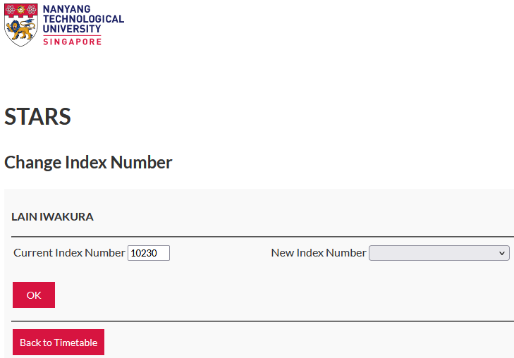

# about

this is a **firefox** browser extension that helps you auto refresh STARS course index pages, and alerts you if it finds an index you want.

(for the singapore ntu, not the taiwan ntu)

# installation

if the extension isn't available on firefox addons, you have to load it as a temporary addon.

1. download all the code, as a `.zip` or individual files.

2. go to (about:debugging#/runtime/this-firefox)[about:debugging#/runtime/this-firefox]

3. click "load temporary add-on" and open the `.zip`. if it's not zipped, open the `manifest.json`.

4. the extension icon should be in the menu now. if you don't see it, right click the toolbar and click customize toolbar. then drag "extensions" onto it, and the icon will be in that menu.

# how to use

1. navigate to the index change page (https://wish.wis.ntu.edu.sg/pls/webexe/AUS_STARS_MENU.menu_option) on STARS: 

2. click the extension icon.

3. enter the indices that you want, in descending order of preference. space separated. type carefully, i was lazy to code input validation.

4. click start. allow notifications if prompted.

5. you can let the extension popup close, but **do not close the tab.**

6. once an index is found you will get a system notification.

# contributing

feel free to use any part of this code elsewhere, but please link back here. under the AGPL license you also have to make your code open source.

uses manifest v3 so you could maybe port it to chrome. i'm not going to though because i'm spreading propaganda.

you can send PRs but i might not address them during the semester.